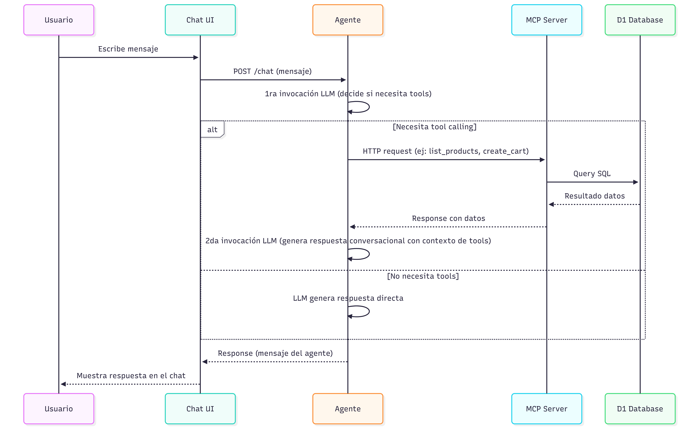

# Arquitectura - MCP E-commerce Agent

## Diagrama de Flujo

## MCP Tools

1. **search_products** — Busca productos por nombre o descripción.
   - `query`: string

2. **get_product_detail** — Detalle de un producto por ID.
   - `product_id`: string

3. **create_cart** — Crea un carrito con items.
   - `items`: array de `{ product_id: string, quantity: number }`

4. **get_cart** — Consulta el estado actual del carrito.
   - `cart_id`: string

5. **update_cart** — Modifica cantidades o elimina items (quantity 0 = eliminar).
   - `cart_id`: string
   - `product_id`: string
   - `quantity`: number